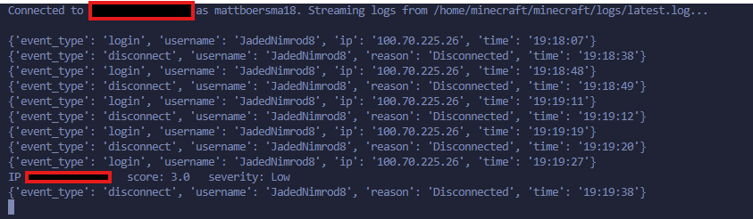

# Mini-SIEM-For-Local-Minecraft-Servers
This project is a project designed to monitor and track activity in a Minecraft server. This program tracks different types of data and alerts the user of any issues potentially going on with the server.

To start, we have to get the program to actually read what is going on inside of the server, were going to use two different pythong imports in order to do this, paramiko and dotnv

Paramiko is a open source library that I will be using to connect directly to the server, it allows the code to connect directly via SSHv2 which is exactly what we want. This makes sure that we have direct contact with the server, and that we dont have to go through multiple mediums in order to check on our server.

Dotenv is a library that allows us to load configuration settings safely, without anyone seeing them. We can create a .env file with sensitive information and the program will automatically withdraw information from that file. API keys, passwords, usernames, IP addresses are just some of the things that we can keep secure inside of a .env file.

In order to initiate offensive security measures for our program, such as banning and kicking players, we will have to use another library called MCRCON.

MCRCON is a library that installs the Minecraft Remote Console (RCON). This allows you to run commands to the server, create announcements or player whitelists with the program. This library is used to deploy the offesnive security features like banning certain IP addresses that have been detected.

The actual code starts in main with setting up all of our connection variables, such as the Host, port, username, etc. Then the code initiates a connection to the ssh server with our .env file information. If something goes wrong, and the server cannot connect, then the connection will time out.

We then run a command to read the system from our connection. If successful, the program will give a success message, then it will begin reading the logs coming from the actual server system. The actual logs coming from the server are a little difficult to read, so the parser.py file takes the logs and makes them more readible. This file takes in the logs, recompiles them to a more readible format, then displays it as a parser.

All of the tracking and rules for the file goes into the rules.py file, where each server rule is coded. The first rule is a rapid reconnect alert. The code keeps a history every 30 seconds of connections and disconnects. If a user at a IP address is rapidly connecting and reconnecting, then the server will show an alert to the terminal, displaying that there may be an active rapid reconnect attack.

Another segment of the code is the severity file, which keeps a score of severity of certan ip addresses and what they are doing. For example, if a certain IP address is trying to do multiple login attempts and spam login attempts, it will start with a low severity and then upgrade to medium and high as the score increases. This will allow the MCCRON library to ban that specific IP address even if the attacker attempts to swtich usernames.

The last two files of the code are the rcon client file and the response file. The rcon_client file sets up the offensive security measures like banning and kicking players.

This is what the program produces when ran, a connection message, followed by joins and disconnects, as well as a small alert for rapid connection and reconnection,

Lessons Learned:
This project taught me how to design and debug a multi-layered distributed system, from establishing secure SSH connectivity between machines on a home network, to adapting mid-project when my initial assumptions about log architecture (flat files vs. systemd/journald) turned out to be wrong. I learned to structure a Python application into clean, single-responsibility modules, manage credentials safely with environment variables, and isolate dependencies using virtual environments. Building the detection logic itself introduced me to core security engineering concepts such as stateful, time-windowed pattern detection, a tiered severity-scoring model with score decay, and critically designing automated response systems with safety guardrails like self-whitelisting and action deduplication to prevent the tool from taking harmful action on false positives. Throughout, I practiced methodical debugging: isolating each layer of the stack (network access, file permissions, application logic) individually rather than guessing at failures across the whole pipeline, and reading tracebacks carefully to catch real bugs like premature connection closures and data-structure mismatches.

Although there are many things Id like to add to this project, Id love to make the display more clean and not run out of a terminal. Having a well desgined application would make the tool easier to use and read. With this Id like to have alerts be sent to users via Discord or email. I think this would be not only more conveinent, but also more applicable in a real world use. Many users of a program might not have the program open all of the time, and having alerts be sent right to them makes it easy to jump onto a problem. Id also like to add more detection to chat logs of the server as well, to monitor flood detection and spam, as well as focus on the disconnect reasoning. Right now, the disconnect reasoning is more broad but with real world data, it could be stronger and more apllicable.

